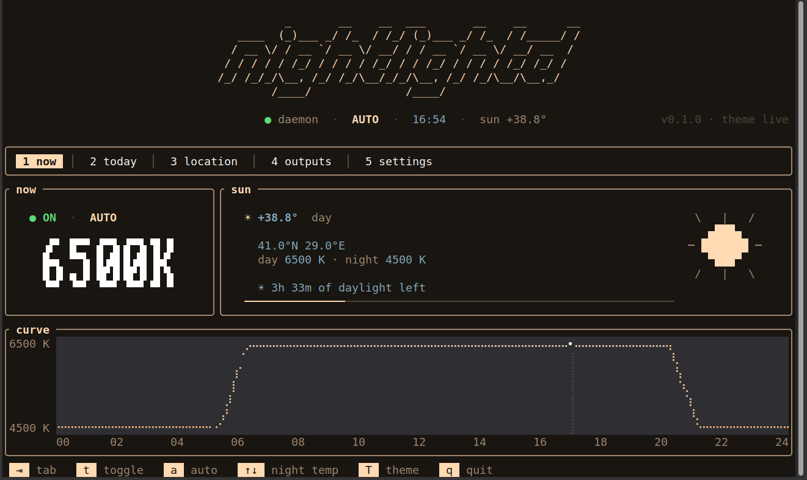
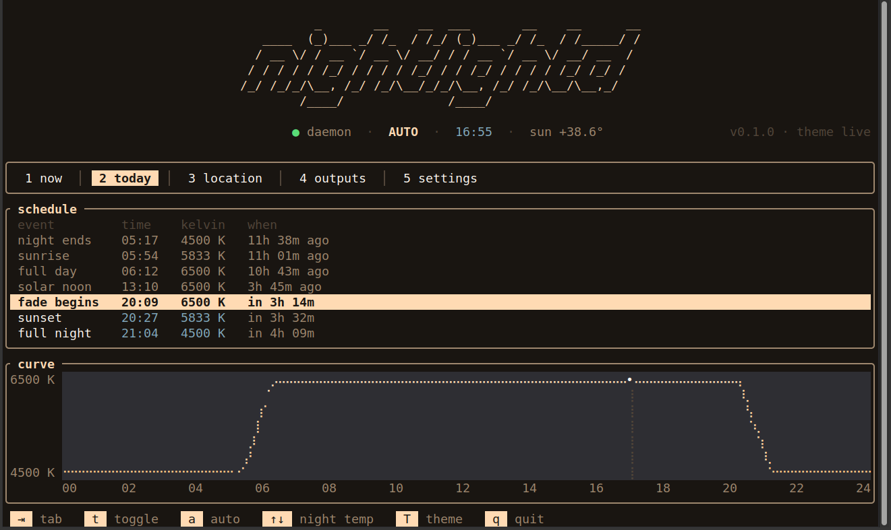
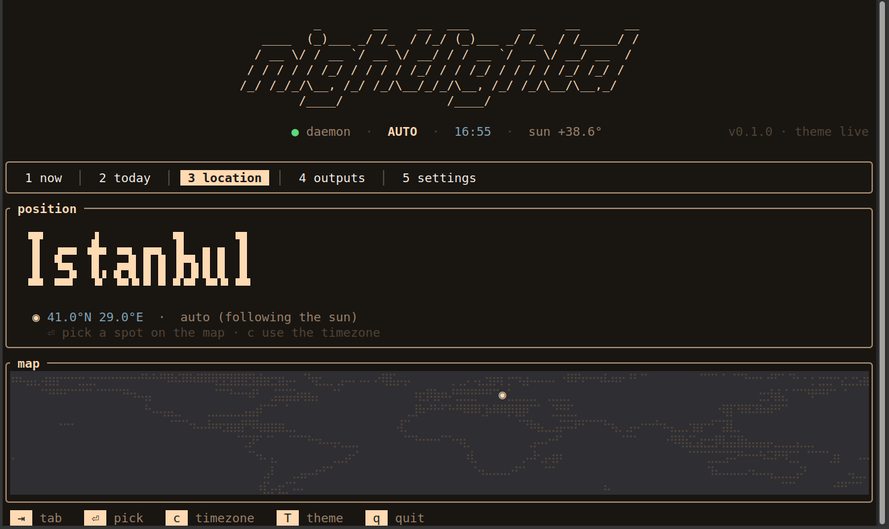
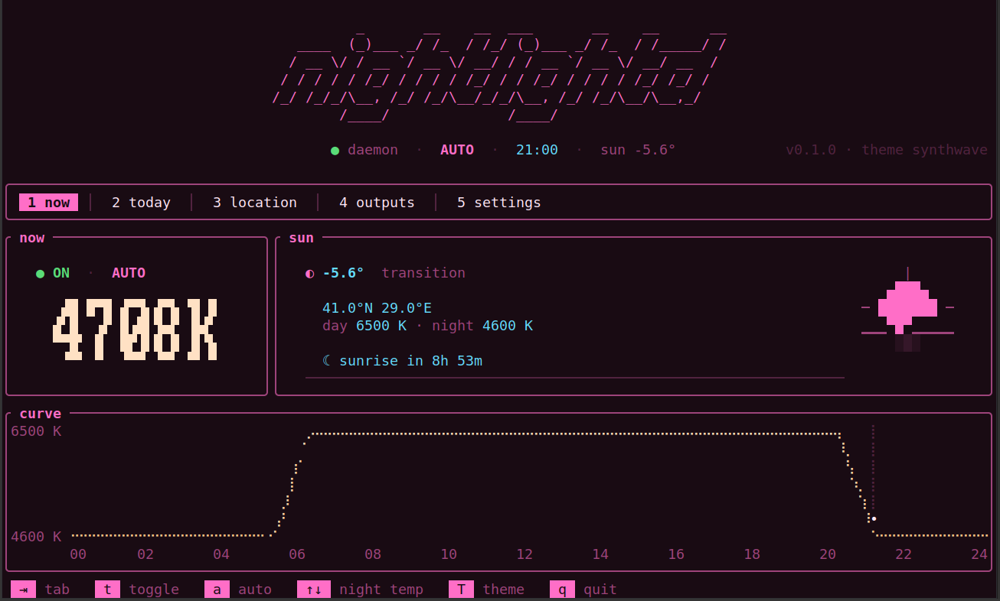

```
          _       __    __  ___       __    __      __
   ____  (_)___ _/ /_  / /_/ (_)___ _/ /_  / /_____/ /
  / __ \/ / __ `/ __ \/ __/ / / __ `/ __ \/ __/ __  /
 / / / / / /_/ / / / / /_/ / / /_/ / / / / /_/ /_/ /
/_/ /_/_/\__, /_/ /_/\__/_/_/\__, /_/ /_/\__/\__,_/
        /____/              /____/

  zero-config screen colour temperature for X11
  reads your timezone · refuses to run twice · survives suspend
```

[](https://github.com/umutdinceryananer/nightlightd/actions/workflows/ci.yml)
[](LICENSE)
[](https://ratatui.rs/)

> **Status: v0.1.0.** The daemon works — timezone-based location, a single-instance D-Bus lock, gamma ramps over XRandR, re-apply on resume from suspend, a `--status` readout — and so do the interfaces: a tray icon, an f.lux-style settings panel, and a full-screen terminal dashboard. A [release with a `.deb`](https://github.com/umutdinceryananer/nightlightd/releases/latest) is out and it is [on the AUR](https://aur.archlinux.org/packages/nightlightd); Flatpak is next. Young software, one machine's worth of dogfooding — expect rough edges, and please report them.

<p align="center">
  
</p>

The interface warms with the screen. In the default `live` theme the accent colour *is* the tint the daemon is filtering to right now — soft gold by day, deep candle-orange at night — so the dashboard reads warmer as the evening comes on. Everything on screen is derived from that one colour.

---

## X11 only

This tool writes gamma ramps through XRandR. That mechanism does not exist under GNOME's or KDE's Wayland sessions, and it never will. Wayland support, if it ever lands, will cover wlroots compositors only (Sway, Hyprland, river) through a separate backend.

If you are on Wayland today, use [`wl-gammarelay-rs`](https://github.com/MaxVerevkin/wl-gammarelay-rs).

---

## Why this exists

redshift was archived in April 2026. gammastep took its place and is maintained, packaged everywhere, and works. This project is not "a maintained redshift" — that already exists.

It exists to fix three defects that gammastep inherited from redshift's architecture and cannot easily shed. Each one was measured, not assumed. The evidence, with commands and outputs, is in [`docs/PRIOR-ART.md`](docs/PRIOR-ART.md).

**1. It will not start without being told where you live.**
With no config file and no `-l`, gammastep prints its settings, hangs at location acquisition, and applies nothing — with no error message. Geoclue2, its only automatic provider, is unavailable on most desktops.

`nightlightd` reads `/etc/localtime` and looks the coordinate up in the timezone database that every Linux system already ships. No network, no permissions, no questions. Sunset lands within a few minutes of correct, which is all the transition curve needs.

**2. Two copies can run at once, and the screen flickers.**
Nothing prevents it. On a stock Mint Xfce install, four redshift instances had accumulated from three autostart mechanisms that do not know about each other.

`nightlightd` claims a DBus name on startup. A second instance finds the name taken and exits. The failure mode is architecturally impossible.

**3. It does not react when the ramp is wiped.**
`nm -D` on the gammastep binary shows no `xcb_randr_select_input`. It never subscribes to RandR events, so it cannot notice a resume from suspend, a resolution change, or a monitor being plugged in. It recovers on its next polling tick, if at all. It reads `get_screen_resources_current`, so hotplugged monitors are likely never seen.

`nightlightd` subscribes to screen events and rewrites the ramp when they fire.

Everything else — packaging, systemd units, solar-elevation scheduling — gammastep already does well. Those are not selling points here.

---

## The interface

The daemon needs none — it runs headless. But three thin clients ship with it, each a separate process that holds no state and talks only over D-Bus, so if one crashes the filter keeps running:

- **A tray icon** (`nightlight-tray`) — on/off, automatic/manual, current temperature, in the notification area.
- **A settings panel** (`nightlight-panel`) — an f.lux-style day/night curve and sliders, for when you want to nudge the bounds.
- **A terminal dashboard** (`nightlight-tui`) — the whole state on one glanceable screen, built with [ratatui](https://ratatui.rs).

The dashboard is five tabs, each with something real to show — no filler:

<p align="center">
  
  
  
</p>

**today** derives the day's milestones — night's end, sunrise, full day, solar noon, sunset — from the same solar maths the daemon schedules on, not from hand-set times. **location** shows the city the timezone resolved to and lets you pin a manual spot on the map. And the theme is yours: `live` follows the screen, or pick from a set of two-hue palettes (`synthwave`, `gruvbox`, `nord`, `tokyo-night`, `ember`, `phosphor`) with `T`.

---

## Design

A daemon does the work; thin clients talk to it over DBus.

```
tray icon   ─┐
panel       ─┤
dashboard   ─┼─► DBus ─► nightlightd ─► gamma ramp
CLI         ─┘              ▲    ▲
                            │    └─ RandR events
                            └────── timer
```

The daemon has no interface. If the tray icon dies, the filter lives. One brain, many remotes.

Read [`docs/HOW-IT-WORKS.md`](docs/HOW-IT-WORKS.md) for the long version, written for someone who has never heard of a gamma ramp.

---

## Install

### Debian / Ubuntu / Mint

Grab the `.deb` from the [latest release](https://github.com/umutdinceryananer/nightlightd/releases/latest), then:

```
sudo apt install ./nightlightd_0.1.0-1_amd64.deb
systemctl --user enable --now nightlightd
```

The package installs all four binaries, the systemd user unit, and the tray's
autostart entry — but a *user* unit cannot be enabled for you at install time,
so the daemon needs that one `systemctl --user` line (or a log-out/log-in plus
the panel's "Start at login" box).

### Arch (AUR)

```
yay -S nightlightd
systemctl --user enable --now nightlightd
```

### Any distro (static binaries)

The [release](https://github.com/umutdinceryananer/nightlightd/releases/latest) also carries a musl tarball — fully static builds of the daemon and the terminal dashboard with no library dependencies at all, for x86_64 Linux of any age. Unpack and follow the bundled `INSTALL`.

### From source

Rust toolchain required:

```
cargo install --path cli     # the daemon + CLI: nightlightd
cargo install --path tray    # tray icon: nightlight-tray
cargo install --path panel   # settings panel: nightlight-panel
cargo install --path tui     # terminal dashboard: nightlight-tui

mkdir -p ~/.config/systemd/user
cp dist/nightlightd.service ~/.config/systemd/user/
systemctl --user daemon-reload
systemctl --user enable --now nightlightd
```

---

## Roadmap

Tracked in [`docs/ISSUES.md`](docs/ISSUES.md).

| | | |
|---|---|---|
| M-1 | Upstream fix to gammastep | 🔶 still owed — see below |
| M0 | Skeleton | ✅ done |
| M1 | Core library — colour, sun, timezone | ✅ done |
| M2 | X11 backend | ✅ done |
| M3 | Daemon and event loop | ✅ done |
| M4 | DBus, CLI, systemd, suspend | ✅ done |
| M5 | Tray icon, settings panel, and terminal dashboard | ✅ done |
| M6 | Packaging and release | 🔶 v0.1.0 released, on the AUR · Flatpak and announce remain |

One debt, stated plainly: the original plan was to send the timezone fallback upstream to gammastep *before* writing any Rust — it helps far more people there, and the review would have said whether the other two defects can be patched in place. The Rust got written first. The merge request is still owed and still planned ([`docs/UPSTREAM-MR.md`](docs/UPSTREAM-MR.md)); if it lands and the remaining defects prove fixable upstream, this repository becomes happily obsolete — which was always the acceptable outcome.

---

## Licence

See [`LICENSE`](LICENSE).
