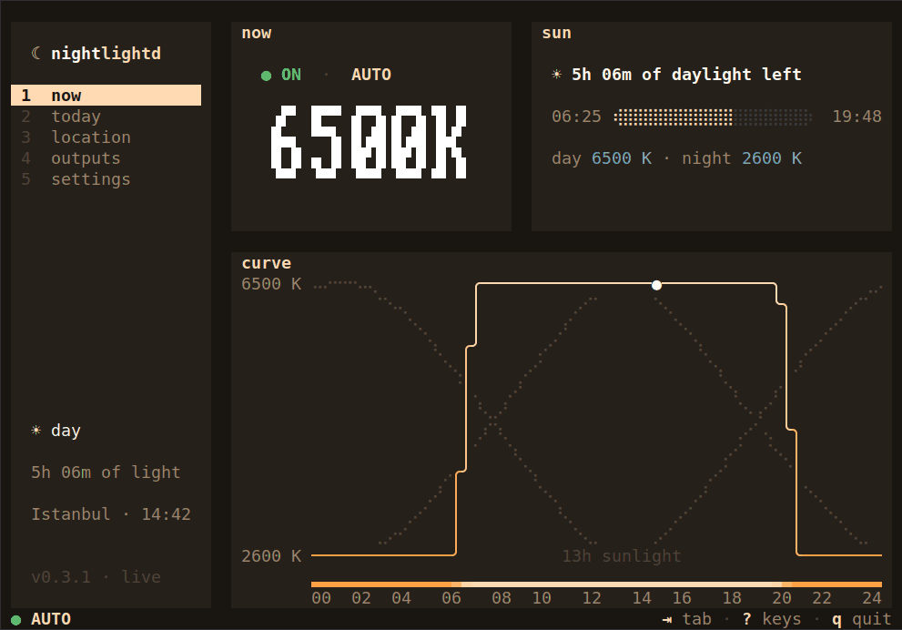
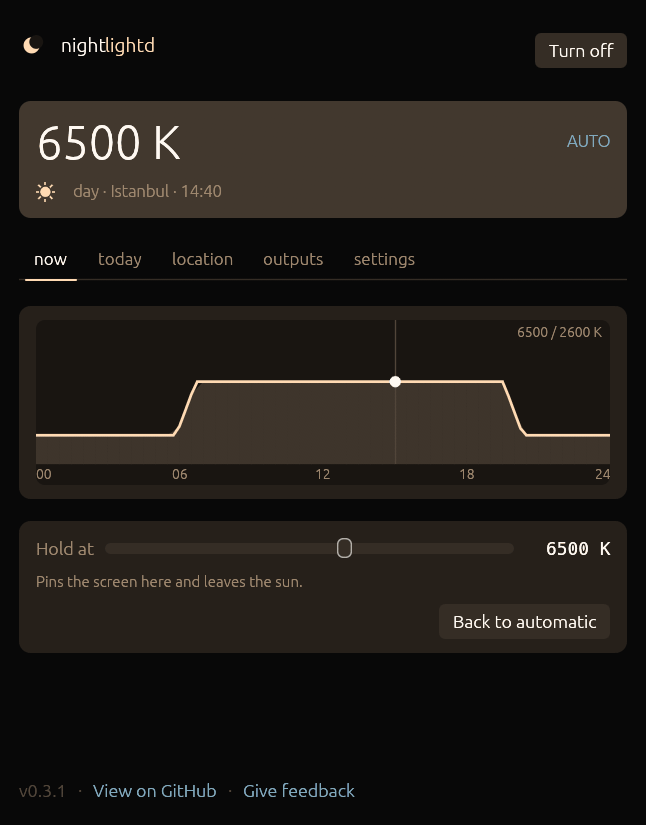
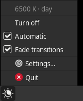
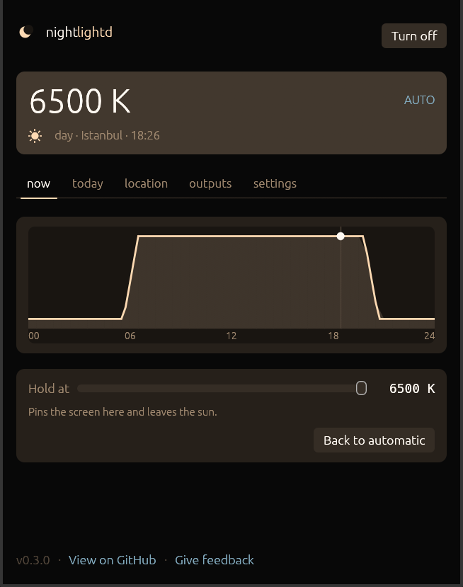
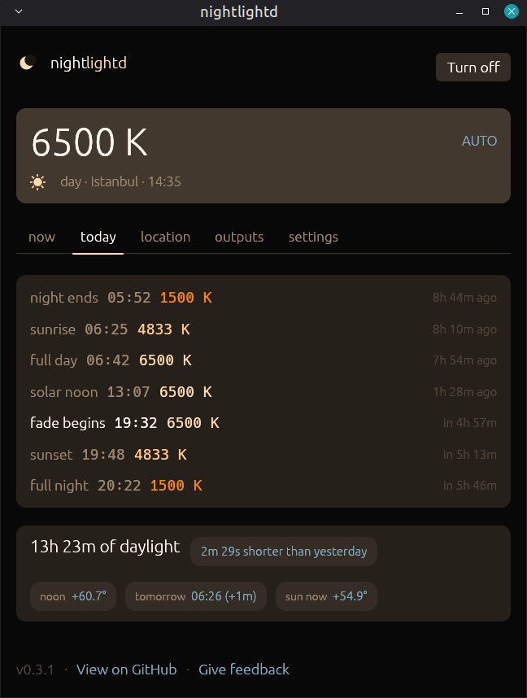
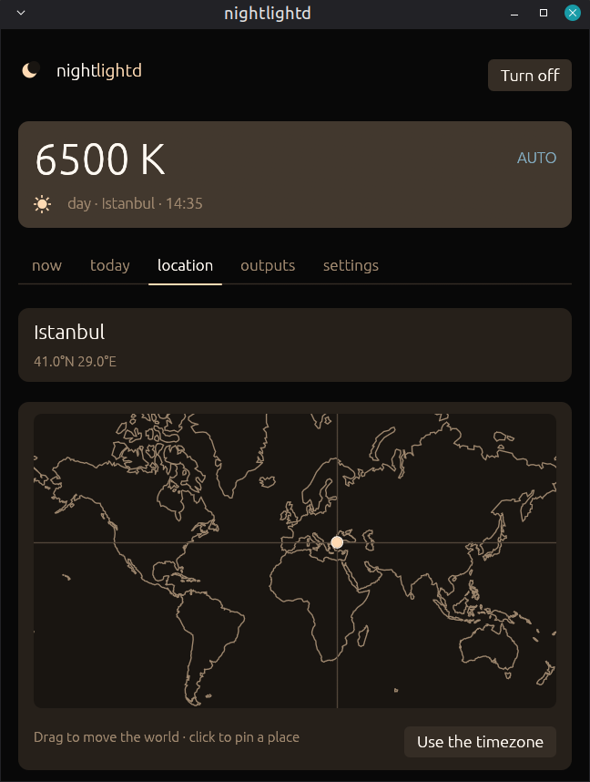
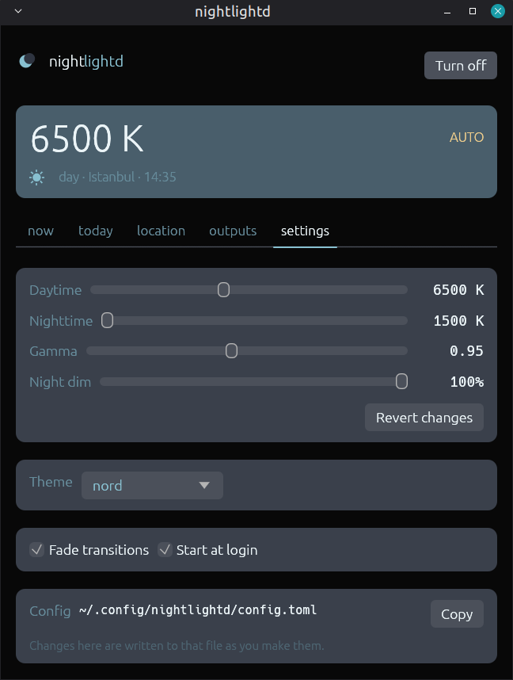
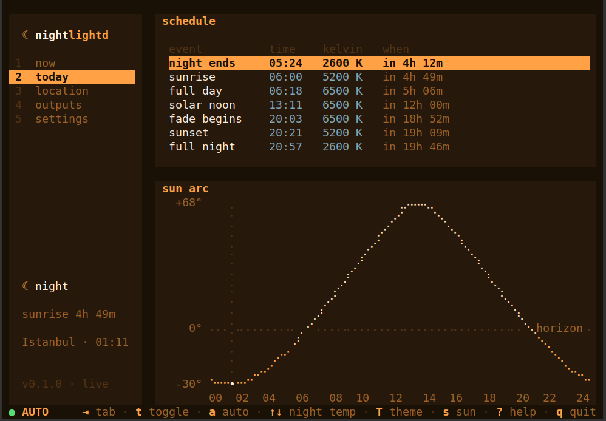
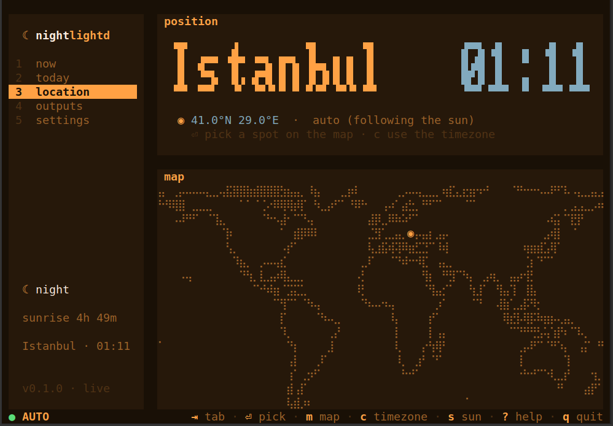
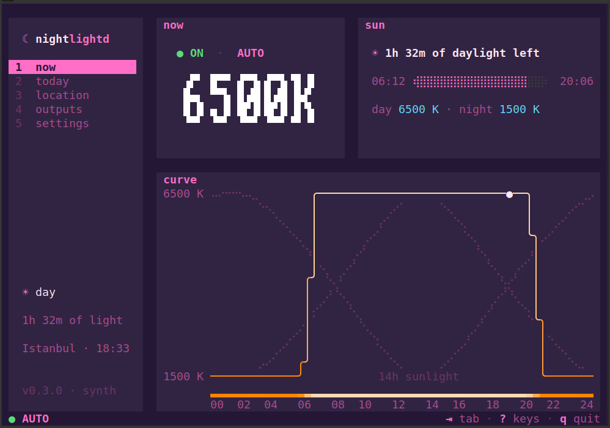

```
          _       __    __  ___       __    __      __
   ____  (_)___ _/ /_  / /_/ (_)___ _/ /_  / /_____/ /
  / __ \/ / __ `/ __ \/ __/ / / __ `/ __ \/ __/ __  /
 / / / / / /_/ / / / / /_/ / / /_/ / / / / /_/ /_/ /
/_/ /_/_/\__, /_/ /_/\__/_/_/\__, /_/ /_/\__/\__,_/
        /____/              /____/

  screen colour temperature daemon for X11
  location from the timezone · single instance · reapplies after suspend
```

[](https://github.com/umutdinceryananer/nightlightd/actions/workflows/ci.yml)
[](LICENSE)
[](https://ratatui.rs/)

> **Version 0.3.1.** The daemon provides timezone based location, a single instance D-Bus lock, gamma ramps over XRandR, eased transitions between targets, a movable transition band, reapplication on resume from suspend, a ramp it checks and repairs when something else clears it, and a `--status` readout. Three clients ship with it, a tray icon, a settings panel, and a terminal dashboard, both windows carrying the same five tabs and the same themes. A [release with `.deb` packages](https://github.com/umutdinceryananer/nightlightd/releases/latest) and an [AUR package](https://aur.archlinux.org/packages/nightlightd) are available. Flatpak is planned. Young software, tested on one machine so far. Report what breaks.

<p align="center">
  
  
</p>

In the default `live` theme the accent colour is the tint the daemon is currently applying, so both interfaces read warmer as evening comes on. Every other colour on screen is derived from that one.

Those are `nightlight-tui --demo` and `nightlight-panel --demo`: a day compressed into half a minute, no daemon required. The dashboard shows each keypress in the corner as it happens; the panel's tour takes hold of the curve, because that is the one thing a screenshot cannot show.

---

## X11 only

This tool writes gamma ramps through XRandR. That mechanism does not exist under GNOME's or KDE's Wayland sessions. Wayland support, if it lands, will cover wlroots compositors only (Sway, Hyprland, river) through a separate backend.

If you are on Wayland today, use [`wl-gammarelay-rs`](https://github.com/MaxVerevkin/wl-gammarelay-rs).

---

## Why this exists

redshift was archived in April 2026. gammastep took its place and is maintained, packaged everywhere, and works. A maintained redshift already exists, and this is not one.

This project fixes three defects that gammastep inherited from redshift's architecture. Each one was measured, not assumed. The evidence, with commands and outputs, is in [`docs/PRIOR-ART.md`](docs/PRIOR-ART.md).

**1. It will not start without being told where you live.**
With no config file and no `-l`, gammastep prints its settings, hangs at location acquisition, and applies nothing. No error is emitted. Geoclue2, its only automatic provider, is unavailable on most desktops.

`nightlightd` reads `/etc/localtime` and looks the coordinate up in the timezone database every Linux system ships. No network, no permissions, no questions. Sunset lands within a few minutes of correct, which is all the transition curve needs.

**2. Two copies can run at once, and the screen flickers.**
Nothing prevents it. On a stock Mint Xfce install, four redshift instances had accumulated from three autostart mechanisms that do not know about each other.

`nightlightd` claims a D-Bus name on startup. A second instance finds the name taken and exits.

**3. It does not react when the ramp is wiped.**
`nm -D` on the gammastep binary shows no `xcb_randr_select_input`. It never subscribes to RandR events, so it cannot notice a resume from suspend, a resolution change, or a monitor being plugged in. It recovers on its next polling tick, if at all. It reads `get_screen_resources_current`, so hotplugged monitors are likely never seen.

`nightlightd` subscribes to screen events and rewrites the ramp when they fire.

Everything else (packaging, systemd units, solar elevation scheduling) gammastep already does well, and none of it is a selling point here.

---

## The interface

The daemon runs headless and needs no interface. Three thin clients ship with it. Each is a separate process that holds no state and talks only over D-Bus, so if one crashes the filter keeps running.

- **`nightlight-tray`** puts on/off, automatic/manual and the current temperature in the notification area.
- **`nightlight-panel`** is a desktop window with the same five tabs as the dashboard. **now** draws the day/night curve, and the curve is also the control: drag a ramp to move the transition band, a plateau to move a temperature, Apply when the shape looks right. **today** lists the day's milestones with the next one lit, under how much daylight there is and how that compares with yesterday. **location** takes a pin on a world map. **outputs** shows every screen the ramp is reaching. **settings** holds the bounds, gamma, night dim, the switches and the theme.
- **`nightlight-tui`** is a terminal dashboard built with [ratatui](https://ratatui.rs).

The tray's menu is the whole of that client: what the screen is doing this
minute, and the four things worth changing without opening a window.

<p align="center">
  
</p>

Both windows wear the same eight themes, each remembering its own choice.

<p align="center">
  
  
  
  
</p>

The dashboard has five tabs.

<p align="center">
  
  
  
</p>

**now** plots the day as a square wave over the sun's crossing arcs, a staircase when the band is widened, with a strip along the floor showing the screen's colour at every hour. **today** derives the day's milestones (night's end, sunrise, full day, solar noon, sunset) from the same solar maths the daemon schedules on, over the sun's own arc drawn the same way. **location** shows the city the timezone resolved to and takes a manual pin on the map. **outputs** lists every screen the ramp is reaching, with its gamma ramp size. **settings** adjusts the day and night bounds, gamma and night dim. `b` over either chart opens the transition band on the arrow keys, drawn live and applied on Enter. `s` summarises the day: its length, the change since yesterday, and when tomorrow starts. `?` lists every key. `T` cycles the themes and the choice sticks. `live` follows the screen; the rest (`tokyo`, `mocha`, `nord`, `gruvbox`, `synth`, `ember`, `phosphor`) are fixed palettes.

Every knob is a number in `~/.config/nightlightd/config.toml`. All fields are optional. These are the defaults, except the shaping examples.

```toml
day_temp = 6500
night_temp = 4500
gamma = 0.9            # bend the ramp's curve, constant all day
night_brightness = 0.9 # dim to 90% at night, easing with the sun
night_elevation = -12  # hold daylight until the sun is 12 degrees down
```

`day_temp` is not capped at neutral. Past 6500 K the screen goes bluish rather than warm, for people who want a cool day and a warm night rather than a normal day and a warm night. Every control stops at 10000 K; the config file and D-Bus accept as far as the ramp table can draw, 25000 K.

Gamma and brightness ride the same gamma ramp write as the colour, so they cost nothing extra and reset with it. Nothing is adaptive. No screen sampling, no backlight control, by design.

Every change of target, a toggle, a manual set, the daemon starting at night, eases onto the screen over about two seconds rather than landing in one frame. The walk is taken on the mired scale, so the glide looks even to the eye the whole way down. `fade = false` in the config, or the same toggle in any interface, turns it off.

Repairs do not ease, on purpose. Coming back from suspend, plugging a monitor in, or having the ramp cleared out from under you are not changes of target — the screen is simply wrong, and the tint snaps back. Easing there would animate the defect and leave the screen wrong for two seconds longer.

The slow transition is movable too. Full day sits at a sun elevation of +3 degrees and full night at -6, the band redshift uses. `day_elevation` and `night_elevation` move the bounds, and `nightlightd --band 3:-12` does the same from a terminal. Lowering the night bound lands full night deeper into dusk, for eyes that find the default too eager. A nonsense pair quietly behaves like the default.

---

## Design

A daemon does the work. Thin clients talk to it over D-Bus.

```
tray icon   ─┐
panel       ─┤
dashboard   ─┼─► DBus ─► nightlightd ─► gamma ramp
CLI         ─┘              ▲    ▲
                            │    └─ RandR events
                            └────── timer
```

The daemon has no interface of its own. If a client dies, the filter keeps running.

[`docs/HOW-IT-WORKS.md`](docs/HOW-IT-WORKS.md) is the long version, written for someone who has never heard of a gamma ramp.

---

## Install

### Debian / Ubuntu / Mint

Two packages, from the [latest release](https://github.com/umutdinceryananer/nightlightd/releases/latest). `nightlightd` is the daemon, the CLI, the tray icon and the terminal dashboard, and depends on nothing but libc. `nightlightd-panel` is the settings window, kept apart because it is the one piece that needs a graphics stack — eight X11 and GL libraries, and 27 MB against the other three's 17.

```
# the daemon, the tray icon and the terminal dashboard
sudo apt install ./nightlightd_0.3.1-1_amd64.deb

# the settings window, if you want it
sudo apt install ./nightlightd-panel_0.3.1-1_amd64.deb

systemctl --user enable --now nightlightd
```

A *user* unit cannot be enabled at install time, so the daemon needs that one
`systemctl --user` line (or a log-out/log-in plus the panel's "Start at login"
box).

**Upgrading from 0.3.0 or earlier:** the settings window used to live in the
main package. Upgrading `nightlightd` by itself takes it away, and the tray's
"Settings…" item goes quiet with it. Install `nightlightd-panel` alongside to
keep the window.

### Arch (AUR)

```
yay -S nightlightd
systemctl --user enable --now nightlightd
```

### Any distro (static binaries)

The [release](https://github.com/umutdinceryananer/nightlightd/releases/latest) also carries a musl tarball, fully static builds of the daemon and the terminal dashboard with no library dependencies, for x86_64 Linux of any age. Unpack and follow the bundled `INSTALL`. The tray and the panel are not in it — they need a graphical toolkit and cannot be built static — so take those from the `.deb` or the AUR.

### From source

Requires a Rust toolchain.

```
cargo install --path cli     # the daemon + CLI: nightlightd
cargo install --path tray    # tray icon: nightlight-tray
cargo install --path panel   # settings panel: nightlight-panel
cargo install --path tui     # terminal dashboard: nightlight-tui

mkdir -p ~/.config/systemd/user
cp dist/nightlightd.service ~/.config/systemd/user/
systemctl --user daemon-reload
systemctl --user enable --now nightlightd
```

---

## Roadmap

Tracked in [`docs/ISSUES.md`](docs/ISSUES.md).

| | | |
|---|---|---|
| M-1 | Upstream fix to gammastep | 🔶 MR open, awaiting review (below) |
| M0 | Skeleton | ✅ done |
| M1 | Core library (colour, sun, timezone) | ✅ done |
| M2 | X11 backend | ✅ done |
| M3 | Daemon and event loop | ✅ done |
| M4 | DBus, CLI, systemd, suspend | ✅ done |
| M5 | Tray icon, settings panel, terminal dashboard | ✅ done |
| M6 | Packaging and release | 🔶 v0.3.0 released, on the AUR. Flatpak remains |

The timezone fallback went upstream before the Rust port of it was written. [`chinstrap/gammastep!28`](https://gitlab.com/chinstrap/gammastep/-/merge_requests/28), opened 2026-07-10, adds the same provider in C, where it helps far more people. It has been awaiting review since. Upstream's last commit is from March 2025 and its oldest open merge request dates to 2020, so a long wait is expected. What the attempt revealed is recorded in [`docs/PRIOR-ART.md`](docs/PRIOR-ART.md) under "Upstream attempt". If it lands and the remaining defects prove fixable upstream, this repository becomes obsolete, which was always an acceptable outcome.

---

## Licence

See [`LICENSE`](LICENSE).
